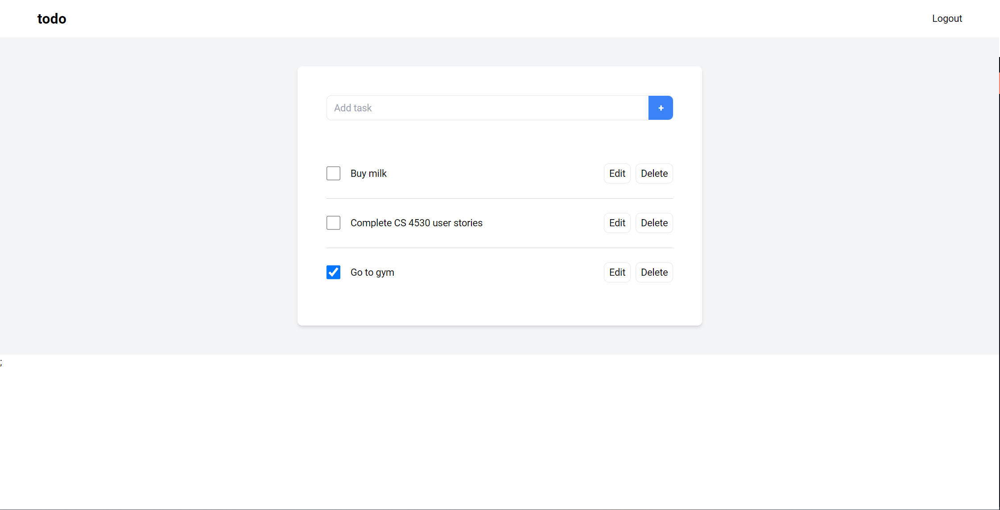

# todo



A simple todo application built using Node.js and TypeScript.

This project has been developed to act as a **reference** for the CS 4530 "husksheets" project. It provided a basic structure for the code, and has the following features which are part of the "husksheets" project specification:

1. Backend server in Node.js using TypeScript; API using REST protocol
2. Frontend app using React and TypeScript
3. Basic Authentication (username and password)
4. User registration and login
5. Data Storage (MongoDB)
6. CRUD operations on a entity (Task)

The following features are required by the "husksheets" project specification, but are not implemented in this project:

1. Error Handling: The code has some basic error handling, but does not cover every corner case.
2. Comments
3. Tests: The code currently contains only tests for some of the server functionality, and no tests for the frontend code. The project specification requires extensive tests for both the server and frontend.
4. HTTPS: The project specification requires the server to be running on HTTPS.
5. Makefile: The project specification requires a Makefile.

For information about Docker and how to setup a Docker Compose file, go to [DOCKER.md](DOCKER.md).

If you have questions about this project, contact Anikesh G Kamath (email: kamath.ani@northeastern.edu or on Piazza).

---

## Deployment

### Docker

To run the todo application using Docker using VS Code,

1. Install [Docker Desktop](https://www.docker.com/products/docker-desktop/) which will install Docker Engine.
2. Install the [Docker VS Code Extention](https://marketplace.visualstudio.com/items?itemName=ms-azuretools.vscode-docker).
3. Right-click the `docker-compose.yml` file and click the `Compose Up` command.
4. The React app will be accessible on `http://localhost`.

If you prefer to use the command line, then run the following command in the root of the project:
```
docker-compose up
```

The logs can be monitored using Docker Desktop.

To shut down the todo application, right-click the `docker-compose.yml` file and click the `Compose Down` command.

For the command line:
```
docker-compose down
```

### Local

#### Pre-Requisites
1. Node.js (v20 or greater)
2. MongoDB (MongoDB Compass is optional)

#### Install
1. Clone the GitHub repository.

```
git clone git@github.com:anikeshk/todo.git
```

2. Go to the server folder and install dependencies.
```
cd server
npm install
```

3. Copy the `.env.example` file to `.env` and make any necessary changes.
```
cp .env.example .env
```

4. Go to the app folder and install dependencies.
```
cd ../app
npm install
```

5. Copy the `.env.example` file to `.env` and make any necessary changes.
```
cp .env.example .env
```

#### Run

1. Open two terminals and go to the root of the project. In the first terminal, go to the server folder, build and run the server.
```
cd server
npm run build && npm run start
```
The backend API is now accessible at `http://localhost:5000`.

2. In the second terminal, go to the app folder and run the app.
```
cd app
npm run dev
```
The frontend React app is now accessible at `http://localhost:3000`.
